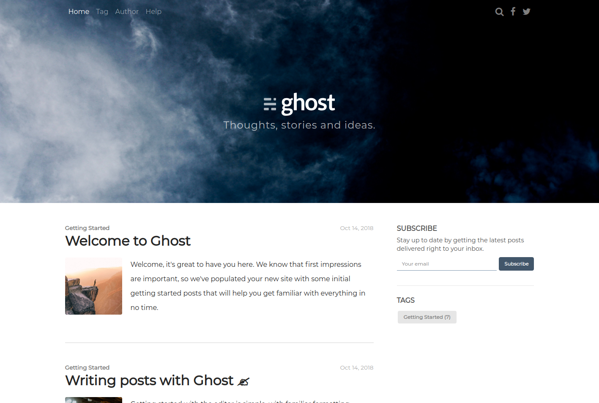
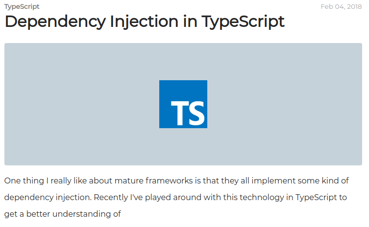

# Haven

[](https://travis-ci.org/nehalist/Haven)
[](https://github.com/nehalist/Haven/releases)
[](https://github.com/nehalist/Haven/blob/master/LICENSE)

A Ghost theme. ***Work in Progress***



## Features

- Responsive layout
- Post search (*Custom implemented*)
- Translatable
- Sidebar (*optionally affixed*)
- Featherlight (Image lightbox, *optional*)
- Multiple post layouts (see [post layout](#post-layout))
- [Syntax highlighting](#syntax-highlighting)

*See [Customization](#customization) to enable/disable optional features.*

## Installation

### From Releases

1. Unzip the theme directory to your `content/themes` directory in your Ghost install dir
2. Done.

### From GitHub

1. Clone the repository to your `content/themes` directory in your Ghost install dir
2. Run `npm i` to install dependencies
3. Build the theme by running `npm run build`
4. Done.

## Customization

> **Important**: Every change within the the `assets` directory requires you to [rebuild](#building) the theme.

### General theme options

Sadly Ghost doesn't support custom theme options; but it's still easy to en- or 
disable features shipped with this theme. Open the `assets/js/index.js` file and 
see the initialization of the `Theme` class and change to your needs:

```
(new Theme()).init({
  logoSwitcher: true,
  navbarBgAlpha: true,
  affixSidebar: true,
  featherlight: true
});
```

- `logoSwitcher`: swaps your publication logo to the navbar as soon as you've scrolled past it.
- `navbarBgAlpha`: changes the alpha of the navbar background according to your scroll position. Alpha is set to `1` as 
soon as you're at the end of the header.
- `affixSidebar`: sticks your sidebar to the viewport when scrolling past it.
- `featherlight`: turns images within your posts to responsive image lightboxes.

### Primary theme color

Styling-related things are implemented via SASS which makes it easy to change colors 
or other styles without having to write additional code.

Open `assets/sass/_base.scss` and change everything to your needs.

### Post layout

There are two different post styles available for post previews; a compact one and a more feature image centric one.

| Compact | Non compact |
| --- | --- |
|  |  |

To switch between these layouts set the `$compact-preview-layout` variable to `true/false` in `assets/_base.scss`.

### Syntax highlighting

Syntax highlighting is powered by [Prism](//prismjs.com/). By default it uses the Okaidia theme and supports 
the following languages: Javascript, CSS, Markup, C-like, Typescript, PHP, SASS/SCSS, Twig, YAML and Bash.
 
Extending the supported languages or changing the theme can easily be done by modifying the `prismjs` in 
the `.babelrc` file.

In case you don't need the Syntax highlighting at all simply remove these lines from `assets/js/index.js`:

```
import Prism from 'prismjs';
Prism.highlightAll();
``` 

## Development

### Locale development

1. Clone the repository to your `content/themes` directory
2. Install npm dependencies with `npm i`
3. Run `npm run dev` to start webpack with the `--watch` flag
4. SASS and JS will be automatically compiled after changes

### Testing

The theme is tested against

- gscan (`npm run gscan`)
- sass-lint (`npm run sass-lint`)
- eslint (`npm run eslint`)

Alternatively you can run `npm test` to test all of the above.

### Building

To build the theme simply run `npm run build`. This will run `webpack` in production, which will 
automatically take care of asset optimization (aka minification and uglification).

### F.A.Q.

1. **How does the post search work?**

It's a client-side custom implementation based on [lunr.js](//lunrjs.com/) (see [here](assets/js/Search.js)).

2. **Where to report issues / request features?**

Use the [GitHub issue tracker](//github.com/nehalist/Haven/issues).

3. **I've done a thing, do you accept Pull requests?**

Sure. Just make sure [tests](#testing) are succeeding.

3. **How to add comments?**

The `post.hbs` template provides a comment placeholder `section` which is commented out
by default (section id is `comments`). Use this placeholder 
and [paste your comment code there](https://www.ghostforbeginners.com/how-to-enable-comments-on-a-ghost-blog/).

## Author & License

Created by [nehalist.io](//nehalist.io) - Released under the [MIT license](LICENSE).
